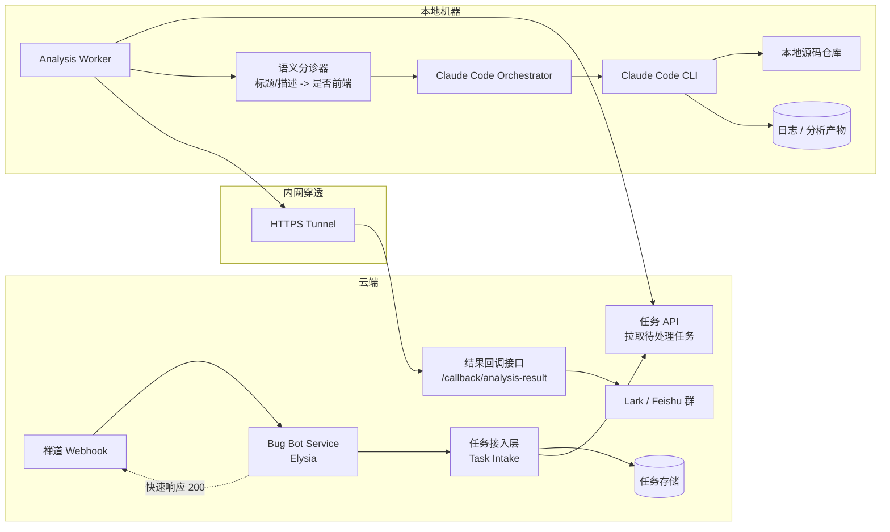
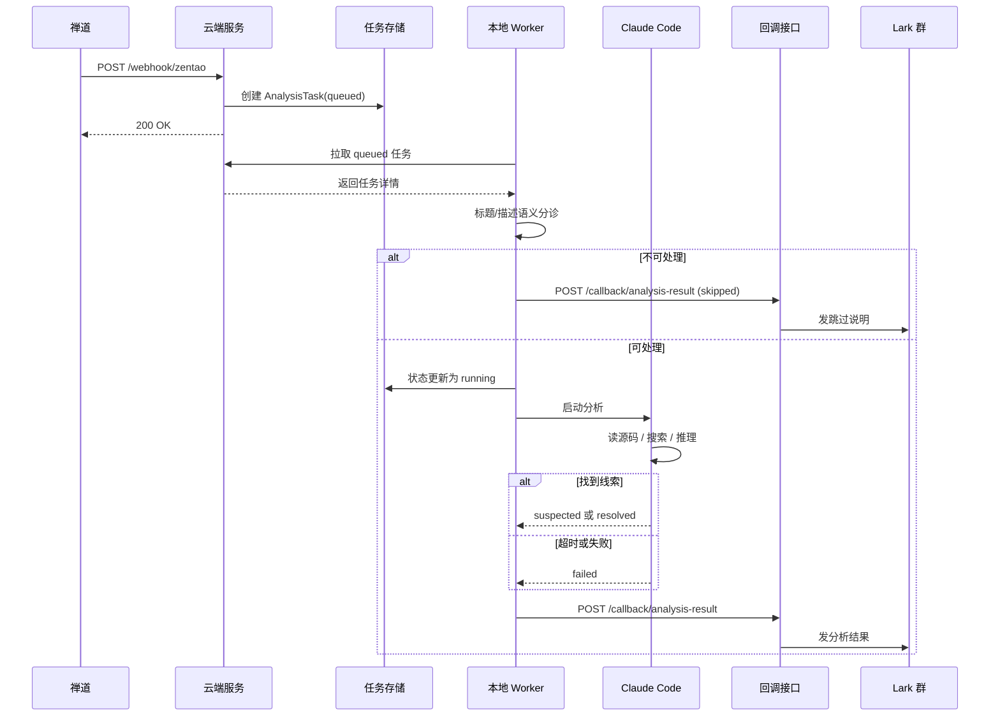
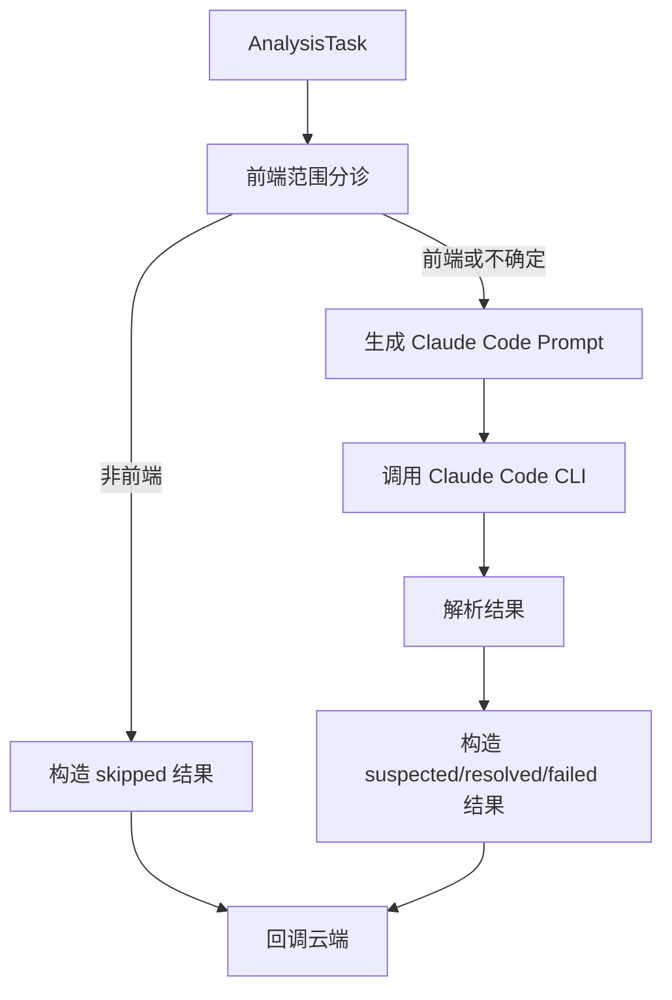

# Claude Code 异步分析架构设计

## 1. 背景

当前系统已经具备两条基础链路：

- `POST /webhook/zentao`：接收禅道 bug webhook
- `POST /callback/analysis-result`：接收异步分析结果并转发到 Lark 群

现状上，禅道 webhook 进入后会调用一个本地 stub 方法，再由服务将消息转发到飞书群。

补充前提：当前只服务一个前端项目，禅道里提交的 bug 默认都来自这个项目。真正需要筛选的不是“属于哪个项目”，而是“这个 bug 是否属于前端可处理范围”。

下一步目标不是在 webhook 请求链路里直接执行 AI 分析，而是引入一条独立的异步分析链路：

1. 云端服务接收 bug webhook
2. 创建分析任务
3. 本地机器上的 worker 拉取任务
4. worker 调用 Claude Code 分析本地源码
5. worker 将分析结果回调到云端
6. 云端复用现有结果回调接口，把消息发到 Lark 群

其中，本地机器通过内网穿透暴露一个 HTTPS 可访问入口，用于结果回传或必要的控制接口。

## 2. 设计目标

- 不阻塞禅道 webhook 的 HTTP 请求
- 云端与本地职责清晰分离
- 只支持一个 agent：Claude Code
- 用 bug 标题和描述完成前端范围分诊，避免把明显非前端问题交给 Claude Code
- 保留后续扩展到更多项目和更多 agent 的空间，但当前不为此增加过多复杂度
- 允许本地 worker 访问源码、命令行工具和本地技能环境
- 允许分析结果以统一格式回传到现有回调接口

## 3. 非目标

- 当前阶段不做多 agent 统一调度
- 当前阶段不做自动修复和自动提交代码
- 当前阶段不做复杂消息队列系统
- 当前阶段不让云端直接远程控制 Claude Code 的交互会话

## 4. 总体架构



## 5. 核心决策

### 5.1 云端只接单，不执行分析

禅道 webhook 到达后，云端服务只负责：

- 规范化事件
- 创建分析任务
- 返回成功响应
- 接收分析结果回调
- 将最终结果转发到 Lark

云端不直接启动 Claude Code，也不直接读取业务仓库源码。

这样做的原因：

- webhook 响应时间稳定
- 云端公网暴露面更小
- 本地环境更适合访问私有源码、CLI、IDE skill 和调试工具

### 5.2 本地 worker 主动拉任务

推荐采用本地 worker 主动轮询或长轮询云端任务接口，而不是云端通过内网穿透主动把任务推给本地。

优点：

- 本地 worker 生命周期更可控
- 对内网穿透稳定性要求更低
- 鉴权模型更简单
- 云端不会直接持有本地执行会话

### 5.3 内网穿透主要用于 HTTPS 回传

内网穿透这层建议承担较轻职责：

- 本地向云端回传分析结果
- 必要时暴露极少量健康检查或控制接口

不建议把它设计成云端直连本地并远程操控 Claude Code 的主通道，否则超时、连接丢失和权限边界都会变复杂。

## 6. 任务时序



## 7. 逻辑分层

### 7.1 云端服务

建议保留当前 Elysia 服务作为公网入口，并增加一层任务化能力。

建议职责：

- `routes/zentao.ts`
  - 接收禅道 webhook
  - 提取 `issueId`
  - 创建内部事件
- `services/event-processor.ts`
  - 保留事件标准化职责
  - 对 `zentao.webhook.received` 改为创建分析任务，而不是执行本地逻辑
- `services/analysis-task-service.ts`
  - 创建任务
  - 更新任务状态
  - 查询待处理任务
- `routes/analysis-callback.ts`
  - 接收 worker 回调结果
  - 转换成统一事件
  - 复用现有消息发送逻辑

### 7.2 本地 worker

本地 worker 是独立进程，不属于当前云端 HTTP 服务进程。

建议拆分：

- `worker/poller`
  - 从云端拉取待处理任务
- `worker/task-classifier`
  - 根据 bug 标题和描述判断是否为前端可处理问题
  - 输出 `frontend`、`non-frontend`、`uncertain` 三类结果
  - 当前阶段推荐采用“规则 + 轻量 LLM”混合分诊，而不是让 Claude Code 直接承担第一层判断
- `worker/claude-code-runner`
  - 准备 prompt
  - 调用 Claude Code CLI
  - 收集 stdout、stderr、退出码、摘要结果
- `worker/callback-reporter`
  - 以统一格式回调云端

## 8. 为什么当前只做 Claude Code

当前只支持 Claude Code，意味着这里不需要抽象出完整的多 agent adapter 层。

可以直接收敛成下面这个最小结构：



这样做的好处：

- 当前系统简单
- 接口面少
- 更快验证真实链路

后续如果确实要支持 Codex 或 Cursor，再把 `claude-code-runner` 提炼成通用 adapter 接口即可。

## 9. 数据模型建议

建议新增内部任务实体 `AnalysisTask`，不要把完整生命周期都塞进 `AppEvent`。

建议字段：

```ts
interface AnalysisTask {
  taskId: string;
  traceId: string;
  issueId?: string | number;
  source: "zentao";
  eventType: "zentao.webhook.received";
  status: "queued" | "running" | "skipped" | "completed" | "failed";
  repoPath?: string;
  triageLabel?: "frontend" | "non-frontend" | "uncertain";
  triageSource?: "rules" | "llm" | "rules+llm";
  decisionReason?: string;
  summary?: string;
  createdAt: string;
  updatedAt: string;
}
```

建议状态含义：

- `queued`：已接单，等待本地 worker
- `running`：本地正在分析
- `skipped`：规则判断为不处理
- `completed`：已有有效分析结果并已回传
- `failed`：分析或回传失败

## 10. 回调载荷建议

建议统一本地 worker 回调云端的数据结构：

```json
{
  "taskId": "task-001",
  "issueId": "BUG-123",
  "traceId": "trace-001",
  "status": "suspected",
  "summary": "定位到前端表单校验逻辑可能导致提交失败",
  "reason": "复现路径与源码分析一致",
  "details": {
    "repoPath": "D:/workspace/project-a",
    "agent": "claude-code",
    "artifacts": [
      "logs/task-001.txt"
    ]
  }
}
```

其中：

- `status` 面向群消息表达分析结论
- `summary` 用于简要展示
- `reason` 用于解释为什么跳过或为什么怀疑这个原因
- `details` 用于调试和追溯，不一定直接发到群里

建议业务结果状态与任务状态分开：

- 任务状态：`queued`、`running`、`completed`、`failed`
- 分析结果状态：`skipped`、`suspected`、`resolved`、`failed`

## 11. 前端 bug 分诊策略

当前只有一个前端项目，所以这里不需要复杂的多项目路由。真正的门禁点是：

- 测试提的 bug 是否属于前端问题
- 是否值得进入 Claude Code 的源码分析阶段

### 11.1 是否一定要用 LLM

如果只靠标题和描述来做判断，我不建议完全依赖纯规则，也不建议一上来就直接启动 Claude Code。

更稳的方案是两段式分诊：

1. 先用少量显式规则做快速筛除
2. 剩余样本交给一个轻量 LLM 做语义判断

原因很直接：

- 纯规则对语义变体不稳，测试描述方式一变就容易漏判
- 直接启动 Claude Code 成本偏高，也会让“是否该处理”与“如何分析代码”这两个职责混在一起
- 单独的轻量分诊步骤更便宜、更快，也更容易调 prompt 和回放样本

所以我更推荐：

- 不把第一层分诊完全做成规则引擎
- 也不让 Claude Code 自己先决定要不要接单
- 增加一个独立的 `triage` 步骤，输入只有标题、描述和少量上下文，输出是否属于前端范围

### 11.2 推荐的混合分诊流程

建议顺序：

1. 规则快速命中明显样本
2. 规则无法确定时，调用轻量 LLM 分类
3. 分类结果为 `frontend` 或 `uncertain` 时，才进入 Claude Code
4. 分类结果为 `non-frontend` 时，直接回调 `skipped`

规则层可以先覆盖这类明显信号：

- 标题或描述出现接口报错、数据库、SQL、后端日志、服务重启、任务调度异常等强后端信号
- 明确提到页面样式、按钮点击、弹窗、表单校验、浏览器兼容、前端报错、控制台报错等强前端信号
- 缺少足够上下文时，不直接跳过，而是标记为 `uncertain`

轻量 LLM 层的职责不是分析源码，只做一个窄任务：

- 输入：bug 标题、描述、必要元数据
- 输出：`frontend`、`non-frontend`、`uncertain`
- 同时返回一段简短理由，便于审计和回调说明

### 11.3 为什么不是纯规则

如果你问“有没有更好的方式，不通过 LLM 来判断是否前端 bug”，答案是：有，但上限有限。

可选的非 LLM 方案主要有两类：

- 关键词和词典规则
- 训练一个传统分类器，比如朴素贝叶斯或逻辑回归

这两类都能做，但前提是你有较稳定的描述习惯或历史样本。对于测试同学自由发挥的标题和描述，语义漂移会很明显，纯规则通常会出现两个问题：

- 误杀：把前端问题判成非前端
- 漏拦：把明显后端问题放进 Claude Code

在当前阶段，样本量和标注体系大概率还不够稳定，所以不值得先走传统分类器路线。

### 11.4 推荐的落地取舍

当前最合适的取舍是：

- 保留一个很薄的规则层，专门处理高置信度样本
- 用一个便宜、快的 LLM 做语义分诊
- Claude Code 只负责真正的源码探索和问题分析

一句话说，这里应该是“LLM 参与分诊”，但不应该是“Claude Code 自己判断自己要不要干活”。

### 11.5 配置建议

因为当前只有一个前端项目，配置可以简化成：

```ts
interface FrontendProjectConfig {
  projectKey: string;
  repoPath: string;
  enabled: boolean;
  defaultBranch?: string;
}
```

而分诊结果建议独立记录：

```ts
interface TriageResult {
  label: "frontend" | "non-frontend" | "uncertain";
  source: "rules" | "llm" | "rules+llm";
  reason: string;
}
```

只有当 `enabled = true` 且 `label !== "non-frontend"` 时，任务才进入 Claude Code。

## 12. 安全与稳定性边界

### 12.1 Claude Code 执行边界

建议默认限制：

- 任务执行超时
- 单机并发限制为 1 到 2
- 独立工作目录
- 按任务记录日志和产物
- 默认只读分析，不直接修改代码

### 12.2 鉴权

云端任务 API 和回调接口至少需要：

- 固定 token 或签名校验
- 时间戳防重放
- 请求日志留痕

### 12.3 可观测性

最少要能按 `taskId` 和 `traceId` 查到：

- 任务创建时间
- 任务状态变化
- Claude Code 是否启动成功
- 回调是否成功
- 发往 Lark 的最终摘要

## 13. 建议的最小落地方案

先做最小可用版本，不要一次把系统做重：

### Phase 1

- 云端新增 `AnalysisTask` 存储
- `zentao` webhook 到来时创建任务
- 本地 worker 轮询拉任务
- 本地增加“规则 + 轻量 LLM”分诊步骤
- 本地只接 Claude Code
- 结果通过现有 `/callback/analysis-result` 回传

### Phase 2

- 增加项目注册表和更完整的门禁规则
- 增加任务重试和失败恢复
- 增加日志归档和产物链接

### Phase 3

- 如果真实需求出现，再抽象多 agent adapter
- 如果任务量变大，再引入正式队列或独立任务服务

## 14. 对当前仓库的落地建议

基于现有代码，建议演进方向如下：

- 保留当前 [code/src/routes/zentao.ts](../code/src/routes/zentao.ts) 作为 webhook 接入点
- 保留当前 [code/src/routes/analysis-callback.ts](../code/src/routes/analysis-callback.ts) 作为统一结果回调入口
- 将当前 [code/src/services/local-task.ts](../code/src/services/local-task.ts) 从“本地方法 stub”调整为“任务投递入口”
- 在云端新增任务服务模块，而不是在 `handleEvent` 中直接执行 Claude Code

一句话概括这套方案：

云端接单和通知，本地判断和分析，Claude Code 只在本地运行，内网穿透只承担轻量 HTTPS 通信。